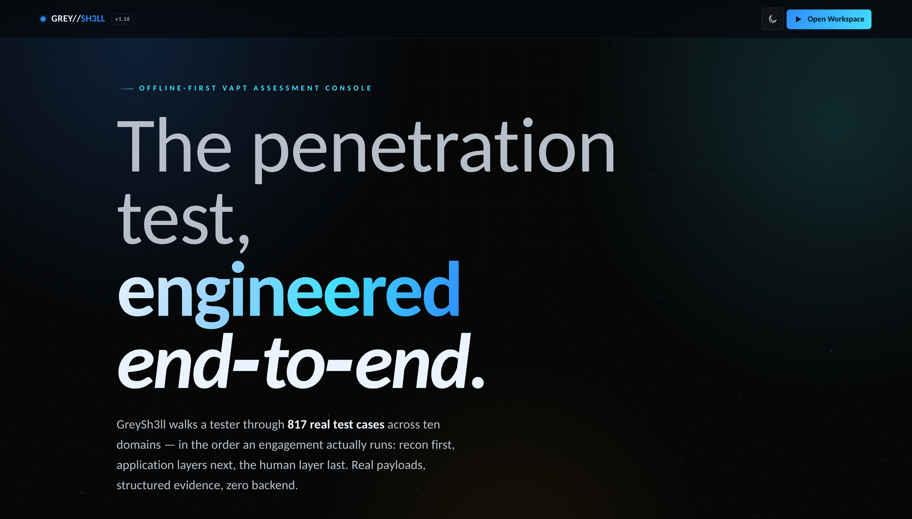
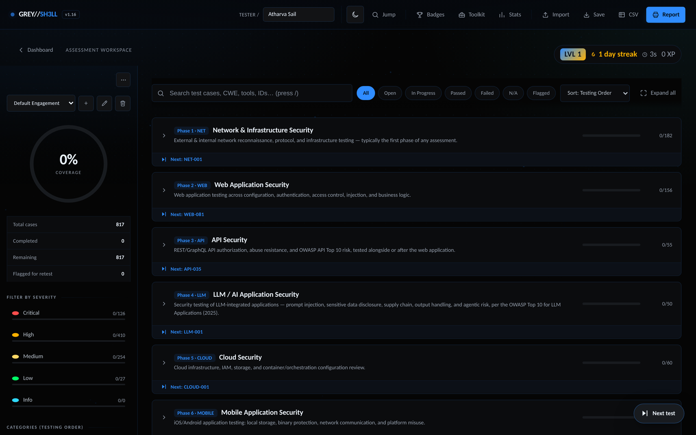
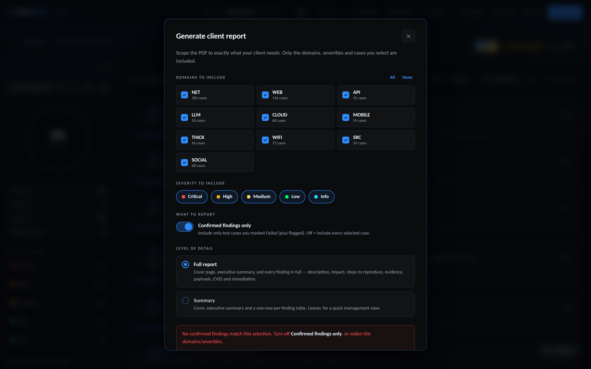

<div align="center">


### A premium, offline-first penetration-testing checklist & assessment console.

Run a full VAPT engagement — track every test case, record findings, and export a
client-ready PDF report — entirely in the browser. **No backend. No build. No data leaves the device.**

<br>

[](https://atharvasail.github.io/GreySh3ll/)

[](../../actions/workflows/deploy.yml)
[](../../actions/workflows/ci.yml)
[](LICENSE)
[](#-changelog)
[](#)
[](#)
[](#-accessibility--security)

</div>

<br>

<div align="center">
  
</div>

<br>

> **817 test cases · 10 domains · real payloads · zero backend.**
> GreySh3ll walks a tester through a structured engagement in the order it actually
> runs — network recon first, application layers next, the human layer last — with
> every case mapped to CWE, OWASP, NIST and MITRE ATT&CK.

---

## ✨ Highlights

|  |  |
|---|---|
| 🗂️ **817 professional test cases** | Across 10 domains, each with description, root cause, impact, steps to reproduce, real payloads, remediation, and full standards mapping. |
| 📊 **Live coverage dashboard** | Coverage ring, severity breakdown, per-domain progress and analytics — all hand-built SVG, no charting library. |
| 📄 **Client-ready PDF reports** | Scope the report by domain, severity and confirmed-findings-only, then export a full professional report — cover, exec summary, per-finding detail. |
| 🧰 **Analyst Toolkit** | Built-in CVSS calculator, payload cheat-sheet, and OSCP-style drills. |
| 🎯 **Smart workflow** | Scan-output import (Nmap / Nuclei / Burp → matching cases), attack-chain analysis, remediation & retest tracking, multi-engagement profiles. |
| 🏆 **Gamified progress** | XP, streaks, levels and unlockable badges to keep long engagements moving. |
| 🎨 **Light & dark themes** | Both WCAG AA-compliant, fully responsive from 320px to ultrawide. |
| 🔒 **Private by design** | Everything runs client-side and saves to `localStorage`. A strict CSP means no inline code and no third-party calls. |

---

## 🚀 Quick start

Because there's **no build step**, running GreySh3ll locally is one command.
Browsers block `fetch()` on `file://`, so serve the folder over HTTP:

```bash
git clone https://github.com/ATHARVASAIL/GreySh3ll.git
cd GreySh3ll
python3 -m http.server 8000
# open http://localhost:8000
```

That's it — open `index.html` for the dashboard, or `assessment.html` for the workspace.

### Deploy to GitHub Pages

GreySh3ll is designed to deploy as-is:

1. Push to a GitHub repository.
2. **Settings → Pages → Build and deployment → Source: GitHub Actions** (or *Deploy from a branch → `main` / root*).
3. The included workflow publishes the site. The `.nojekyll` file is already present so nothing is stripped.

No configuration, environment variables, or secrets are required.

---

## 🖼️ Screenshots

<div align="center">
  
  <br><em>The assessment workspace — sidebar coverage, filters, and the phased test-case checklist.</em>
  <br><br>
  
  <br><em>Scope a client PDF by domain, severity and confirmed findings before exporting.</em>
</div>

---

## 🧩 Domains covered

Ordered the way a real engagement runs — recon first, human layer last.

| # | Domain | Cases | Focus | Standard |
|:-:|---|:-:|---|---|
| 01 | **NET** | 182 | Network & infrastructure recon, protocol & config testing | NIST SP 800-53 |
| 02 | **WEB** | 156 | Web app — auth, access control, injection, business logic | OWASP Top 10 |
| 03 | **API** | 55 | REST/GraphQL authorization & abuse | OWASP API Top 10 |
| 04 | **LLM** | 50 | LLM/AI application security | OWASP LLM Top 10 (2026) |
| 05 | **CLOUD** | 60 | Cloud IAM, storage & container misconfiguration | OWASP Top 10 |
| 06 | **MOBILE** | 59 | iOS/Android storage, binary protection, comms | OWASP Mobile Top 10 |
| 07 | **THICK** | 56 | Desktop/native client binaries, local storage, IPC | OWASP Top 10 |
| 08 | **WIFI** | 72 | Wi-Fi & short-range RF layer attacks | NIST SP 800-53 |
| 09 | **SRC** | 59 | White-box source code review | OWASP Top 10 |
| 10 | **SOCIAL** | 68 | Human-layer & physical — phishing, vishing, pretexting | NIST SP 800-53 |

> **Every category in every domain carries at least five test cases** — no standards
> bucket is left empty, so the coverage picture is always complete.

---

## 📖 Using GreySh3ll

1. **Set your identity** on the dashboard (name, subtitle) — it appears on your report.
2. **Pick a domain** or hit **Smart Continue** to jump to where you left off.
3. **Work each case**: read the description, steps and payloads; set a status
   (Pass / Fail / N/A / In Progress); record findings, evidence and affected endpoints.
4. **Track risk** as you go — coverage, severity profile and open-critical counts update live.
5. **Export**: click **Report**, scope it (e.g. *WEB only, confirmed findings only, full detail*),
   and save the PDF for your client. Progress can also be exported/imported as JSON, or findings as CSV.

Everything saves automatically to your browser. Use multiple **engagement profiles**
to keep separate clients apart.

---

## 🧱 Architecture

Static HTML + CSS + vanilla JS, no dependencies, no bundler.

```
index.html          →  Dashboard (landing + live coverage overview)
assessment.html     →  Workspace (the interactive checklist + reporting)
css/                →  Design tokens, layout, components, themes, print, motion
js/                 →  Data layer, rendering, interactions, toolkit, PDF builder
data/<domain>.json  →  The 817 test cases (source of truth)
tools/*.py          →  Enrichment + build pipeline (categories, ATT&CK, frameworks)
tests/              →  152 unit tests + 18-viewport sweep + contrast & data gates
```

📐 **See [`ARCHITECTURE.md`](ARCHITECTURE.md)** for a full file-by-file code map and
"where do I change X?" guide.

---

## ✅ Tests & quality gates

All gates run in CI on every push (`.github/workflows/ci.yml`).

```bash
cd tests
npm install
npm test            # 152 unit tests (coverage/risk maths, filters, CSP, rendering)
npm run fields      # every case meets all 7 mandatory content fields (817/817)
npm run fullcheck   # 18-viewport Playwright sweep — layout, overflow, a11y
npm run audit sync categories attack frameworks   # data-integrity gates
```

- ✅ **152/152** unit tests
- ✅ **817/817** cases meet the full content bar
- ✅ **WCAG AA** contrast verified in both light and dark themes
- ✅ **18 viewports** (320px → ultrawide) with zero overflow, clipped text or console errors
- ✅ **MITRE ATT&CK** technique IDs validated against MITRE's published set

---

## 🔒 Accessibility & security

- **Content-Security-Policy**: `script-src 'self'; style-src 'self'` — no `unsafe-inline`,
  no third-party origins. All dynamic styling uses `data-*` attributes + CSS custom
  properties. See [`SECURITY.md`](SECURITY.md).
- **Offline-first & private**: no network calls, no analytics, no telemetry. All state
  is `localStorage` on the user's device.
- **WCAG AA**: every text colour is set by contrast ratio, not by eye, and validated by
  `tools/check-contrast.py` in both themes.
- **Payload safety**: all example payloads use RFC-reserved placeholders
  (`example.test`, `<target>`, `<attacker>`) and safe PoCs — nothing that would fire
  against a real host if pasted.

---

## ✏️ Editing test-case data

The test cases live in `data/<domain>.json`. After editing, run the pipeline so the
runtime files and standards mappings stay in sync:

```bash
python3 tools/map-categories.py    # assign OWASP/NIST category
python3 tools/map-attack.py        # map MITRE ATT&CK technique
python3 tools/map-frameworks.py    # add WSTG/ASVS references
python3 tools/build-data.py        # compile index.json / detail/*.json / toolkit.json
```

Then re-run the gates in `tests/` to confirm everything is still green.

---

## 📋 Changelog

- **v1.16 — data-quality pass, engagement fields everywhere, PDF scoping.**
  Every one of the 817 cases now carries the three engagement fields (real-world
  context, difficulty, time-to-test), so the detail panel is consistent across the
  whole corpus. Payload hygiene brought onto one convention (RFC-reserved
  placeholders, professional PoCs) and CWE mappings reconciled. New **Report Options**
  dialog scopes the PDF by domain, severity and confirmed-findings-only, with a full
  professional report (steps to reproduce, payloads, remediation, standards mapping).
  Sidebar full-height + mobile-close fixes; unified light theme and cross-page motion.

- **v1.15 — every category filled to a floor of five, 577 → 817 cases.**
  The standards taxonomy meant some categories were empty or thin; every category in
  every domain was brought to at least five cases, placed by merit rather than quota.
  Added a premium landing page and self-hosted Carlito (metric-identical Calibri) so
  the typography renders the same on every OS.

- **v1.14 — LLM taxonomy corrected to the OWASP 2026 edition, MITRE ATT&CK mapped
  across the corpus** with every technique ID validated against MITRE's published set.

<details>
<summary>Earlier releases (v1.0 – v1.13)</summary>

Earlier work built the core console: the phased checklist, coverage/risk maths, the
Analyst Toolkit, remediation & retest tracking, multi-engagement profiles, scan-output
import, attack-chain analysis, gamification, the light theme, the strict-CSP migration,
and the standards-based category picker. The corpus grew domain by domain to full
coverage across all ten domains.

</details>

---

## 🎯 Scope & responsible use

GreySh3ll is a checklist and reporting aid for **authorized** security assessments.
The example payloads are for use only against systems you have explicit permission to
test. You are responsible for operating within your engagement's scope and the law.

---

## 📜 License

[MIT](LICENSE) © Atharva Sail. Contributions welcome — see [`CONTRIBUTING.md`](CONTRIBUTING.md).

<div align="center">
<br>
<strong>Built for the work itself.</strong> · <a href="https://atharvasail.github.io/GreySh3ll/">Live demo</a>
</div>
